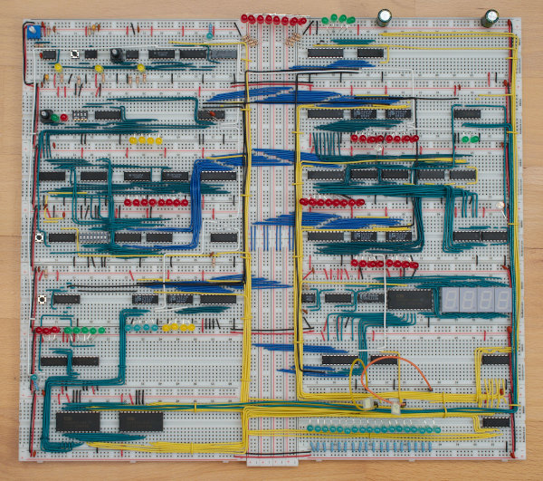
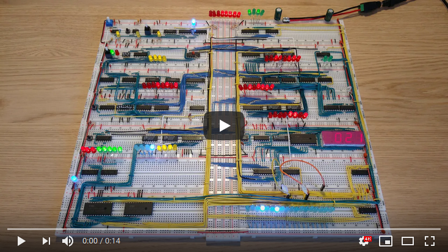

# 8-bit-computer

This is my 8-bit computer. Based on a project by Ben Eater. https://eater.net/8bit

See the computer in action:

More programs with videos and the assembly code can be seen in [programs](programs). Read more about the hardware in [hardware.md](hardware.md). The instruction set is described in [instruction_set.md](instruction_set.md), and the control lines in [control_lines.md](control_lines.md). How they relate can be seen in [instruction_decoding.md](instruction_decoding.md). See [issues.md](issues.md) for a list of the issues I had with getting the computer to work reliably, and what I did to fix them.

See [8-bit-computer-emulator](https://github.com/blurpy/8-bit-computer-emulator) for a version of this computer implemented in software.
