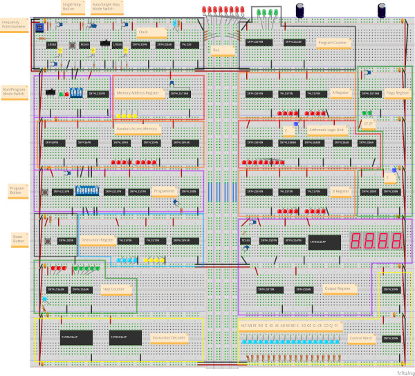
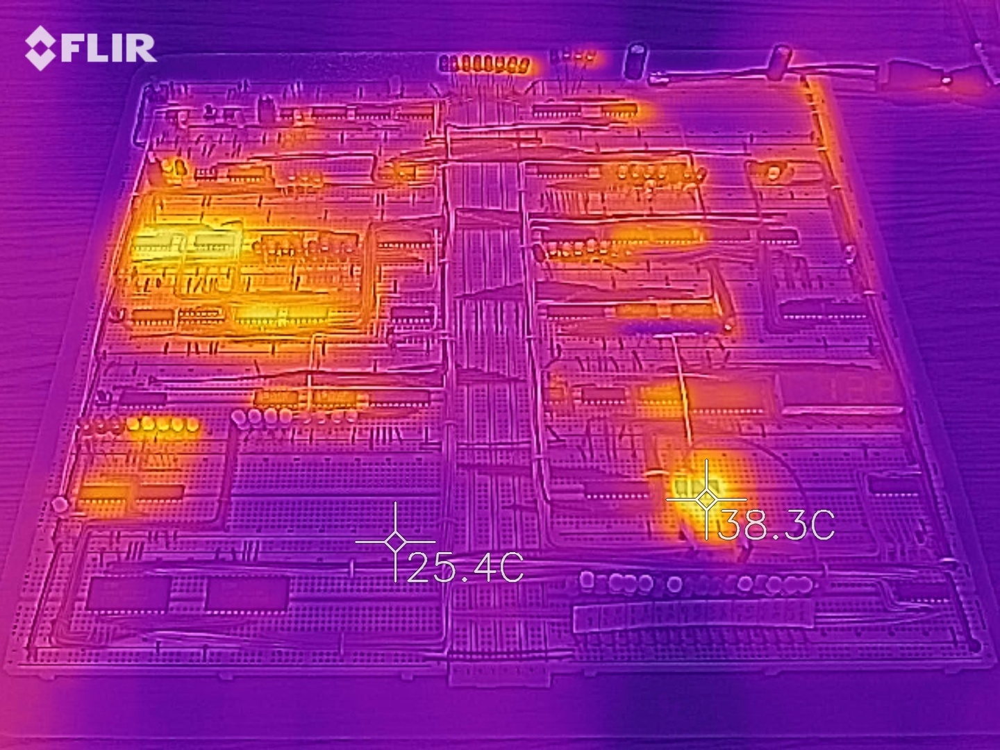

# Hardware

[](resources/8-bit-computer-fritzing.png)

The diagram above has all the components, but most of the wiring is not displayed.


## Summary

* 8-bit wide bus
* 16 bytes of memory (4-bit addressing)
* 2 general purpose registers
* Arithmetic logic unit with support for addition and subtraction
* 7-segment output display
* Programmable using DIP-switches
* Based on the SAP-1 architecture with some additions from SAP-2
* Instruction set is a subset of Intel 8080
* Support for single stepping the clock
* Instruction decoder based on microcode
* Zero and carry flags


## Integrated circuits

|Name|Type|
|---|---|
|555|Timer|
|74LS00|Quad NAND gate|
|74LS02|Quad NOR gate|
|74LS04|Hex Inverter|
|74LS08|Quad AND gate|
|74LS32|Quad OR gate|
|74LS86|Quad XOR gate|
|74LS107|Dual JK flip-flop|
|74LS138|3:8 line demultiplexer|
|74LS139|Dual 2:4 line demultiplexer|
|74LS157|Quad 2:1 line multiplexer|
|74LS161|4-bit binary counter|
|74LS173|4-bit D register|
|74189|64-bit (16 x 4 bits) Static RAM|
|74LS245|8-bit 3-state buffer / bus transceiver|
|74LS273|8-bit D register|
|74LS283|4-bit binary adder with carry|
|AT28C16|16Kb (2K x 8 bits) EEPROM|


## Clock

The clock is a square wave at 50% duty cycle and is used for triggering and synchronizing operations in the computer. Supports variable speed from 1.5Hz to 1kHz and also single stepping.

* Chips
  * 3x 555 timer
    * The first is in astable mode. It generates a 50% duty cycle square wave for a continuous clock timer.
    * The second is in monostable mode. It's used as a debounce circuit for the single step push button, to generate a manual pulse.
    * The third is in bistable mode. It's used as a debounce circuit for mode toggle switch.
  * 74LS04 inverter: these 3 last chips are for creating the logic circuit that allows outputting the clock signal from the selected mode, as well as disabling the clock output when halted.
  * 74LS08 AND gate: see above.
  * 74LS32 OR gate: see above.
* Inputs
  * Potentiometer: for controlling the speed of the clock.
  * Push button: for single stepping the clock.
  * Toggle switch: for switching between continuous mode or single step mode.
* Outputs
  * The normal clock signal.
  * The inverted clock signal. This is just the normal clock signal sent through the inverter.
* LEDs
  * 3x Yellow
    * The first shows the square wave from the first 555 timer.
    * The second shows the debounced output of the second 555 timer.
    * The third shows the mode the clock is in. The LED is off in single step mode and on in continuous mode.
  * 1x Blue: this LED shows the normal outgoing clock signal, either in sync with the clock timer or the single steps. 
* Control signals
  * HLT: halts the clock.


## Memory Address Register (MAR)

A 4-bit register that keeps track of the active memory address for the RAM. 

Can be put in programming mode together with the RAM for manual control with DIP-switches.

* Chips
  * 74LS173 register: for storing the current 4-bit address in run mode.
  * 74LS157 multiplexer: for selecting between the address from the MAR or from the DIP-switch.
* Inputs
  * 4-bit DIP switch: for setting the address in programming mode.
  * Toggle switch: for switching between run mode and programming mode. Also applies to the RAM.
* Outputs
  * The 4-bit address from the selected run mode goes to the RAM.
* LEDs
  * 1x Green: for showing when it's in run mode.
  * 1x Red: for showing when it's in programming mode.
  * 4x Yellow address LEDs: shows the current 4-bit address in the selected mode.
* Control signals
  * MI: store a 4-bit address from the bus into the MAR, on the next clock tick.


## Random Access Memory (RAM)

16 bytes of static RAM.

Any of the 16 bytes can be read and written to, but it behaves like a regular 8-bit register in that it only works with 1 byte at a time. The MAR must be used for selecting which byte to read from or write to.

Can be put in programming mode together with the MAR for manual control with DIP-switches.

* Chips
  * 2x 74189 RAM: for storing 16 bytes of data or instructions. The outputs are inverted.
  * 2x 74LS04 inverter: to invert back the data in the RAM.
  * 74LS245 buffer: to control when it's outputting to the bus.
  * 3x 74LS157 multiplexer
    * The first is used for controlling whether the program button, or the RI control signal can write to the RAM, depending on mode.
    * The two others are used for selecting between the 8-bits of data coming from the bus, or from the DIP-switch, depending on mode.
  * 74LS00 NAND gate: enables the RI control signal only on the rising edge of the clock. 
* Inputs
  * 4-bit memory address from the MAR.
  * Push button: for setting the value from the DIP switch into the current memory address of the RAM in programming mode.
  * 8-bit DIP switch: for setting the value to be put into RAM when pushing the button, in programming mode.
  * Toggle switch: for switching between run mode and programming mode. From the MAR. Goes into all the multiplexers.
* LEDs
  * 8x Red LEDs: for showing the 8-bit value at the current address in RAM.
* Control signals
  * RI: store an 8-bit value from the bus into the current memory address, on the next clock tick.
  * RO: put an 8-bit value from the current memory address onto the bus.


## Reset

Reset button that connects to all the different parts of the computer to clear the state. This is required before starting a program since the computer comes up in a random state, and when restarting a program.

* Chips
  * 74LS00 NAND gate: for creating the necessary signals that will reset the other chips.
* Inputs
  * Push button: for initiating a reset.


## Instruction Register

8-bit register that contains the currently executing instruction.

Instructions are made up of an opcode and an operand, both 4 bits each. The opcode tells which instruction to execute while the operand contains extra data related to the instruction, like a memory address to jump to, or a small value to put into another register. See [instruction_set.md](instruction_set.md) for more about instructions.

The instruction register is very similar to the general purpose A and B registers, except how it's used. The 4 bits for the opcode goes to the instruction decoder, and only the 4 bits of the operand can be put out onto the bus.

* Chips
  * 2x 74LS173 register: these are used for storing the 8-bit instruction.
  * 74LS245 buffer: to control when it's outputting to the bus.
* Outputs
  * The opcode: goes directly to the instruction decoder.
* LEDs
  * 4x Blue: shows the opcode.
  * 4x Yellow: shows the operand.
* Control lines
  * II: store an 8-bit value from the bus into the register, on the next clock tick.
  * IO: put the 4-bit operand of the instruction onto the bus.


## Step Counter

The step counter is a simple 3 bit binary counter, that counts in a loop from 0 to 4. The current step is shown both in binary and decimal using LEDs, and is used by the instruction decoder to know which of the 5 steps of the current instruction to execute.  These steps are also called T-states, or timing states. 

Incrementing the steps happens on the inverted clock to give the instruction decoder time to prepare the control lines before the next normal clock tick.

* Chips
  * 74LS161 counter: for doing the counting.
  * 74LS138 demultiplexer: used for converting the binary value from the counter into decimal. Also used for resetting the counter after it reaches step 5.
* Outputs
  * 3-bit step: goes directly into the instruction decoder.
* LEDs
  * 3x Red: shows the current step in binary. Note that the bit order is opposite compared to the other binary displays, so 4 is `001` instead of `100`.
  * 5x Green: shows the current step, as the LED that is off.
  * 1x Blue: shows the inverted clock.


## Instruction Decoder

The instruction decoder is responsible for orchestrating the control lines of the computer to make it do something useful.

The control lines are the switches to the supported operations of the different parts, like RAM In and Instruction Register Out. Typically an operation either reads (in) from the bus or writes (out) to the bus.

Every instruction takes 5 steps (microinstructions) to complete, called the instruction cycle, split into 2 phases.

The first phase is the fetch phase. It consists of 2 steps that are the same every time:
- step 0: Put the current value of the program counter into the memory address register.
- step 1: Put the value of the RAM at the current address into the instruction register and increment the program counter.

At this point the instruction decoder have access to the opcode from the instruction register, and the execution phase begins. The last 3 steps will differ for each instruction. An example could be to load some data from a specified location in RAM into the B-register, and store the sum of the A-register and B-register into the A-register. This is the ADD instruction.

To make everything work, the instruction decoder gets which step to execute from the step counter on the falling edge of the clock cycle. It will then prepare the control lines for a particular step of a particular instruction, and that combination is called a control word. Output operations are executed right away, while input operations are executed on the next rising edge of the clock cycle.

Some instructions also use flags to make decisions.

EEPROMs are used for implementing the instruction decoder, based on a simple lookup table. See [instruction_decoding.md](instruction_decoding.md) for more details. They both have 11 address lines for inputs, and 8 outputs. 9 of the address lines are used by the opcode, the step and the flags, and are connected the same on both. The EEPROMs combined offer 16 outputs used as control lines, and one address line (A7) is hard wired differently to make the EEPROMs control 2 different sets of 8 control lines, since they are programmed the same.  

* Chips
  * 2x AT28C16 EEPROM: for the microcode that selects which control lines are to be enabled, based on the input.
  * 2x 74LS04 inverter: for inverting control signals going to active low inputs, like the memory address in, so the microcode and the LEDs don't have to worry about whether a signal being "on" activates or deactivates a function.
* Inputs
  * 3-bit step counter value.
  * 4-bit opcode from the instruction register. 
  * 2-bit flags, carry and zero, from the flags register.
* Outputs
  * 16x control lines.
* LEDs
  * 16x Blue: for showing which control lines are active.
  * 2x Blue: these are with the others, but are connected to 2 control lines that are manually controlled.


## Program Counter

4-bit counter (0->15) that keeps track of the memory location of the next instruction to execute.

Normal operation is to output the current value to the bus during the fetch cycle, and increment by 1 afterwards. Also supports jumping to a memory location read from the bus.

* Chips
  * 74LS245 buffer: to control when it's outputting to the bus.
  * 74LS161 counter: for doing the counting.
* LEDs
  * 4x Green: shows the value in the counter.
* Control lines
  * CE: increment the counter by 1, on the next clock tick.
  * CO: put the 4-bit value from the counter onto the bus.
  * CJ: jump, by overwriting the current counter with a 4-bit value from the bus, on the next clock tick.
  

## A + B Register

These are 2 independent 8-bit general purpose registers, primarily used in combination with the ALU.

* Chips
  * 74LS245 buffer: to control when the register is outputting to the bus.
  * 2x 74LS173 register: these are used for storing an 8-bit value.
* Outputs
  * Current value from both registers goes directly to the ALU.
* LEDs
  * 8x Red: shows the value in the register.
* Control lines
  * AI: store an 8-bit value from the bus into the A register, on the next clock tick.
  * AO: put the 8-bit from the A register onto the bus.
  * BI: store an 8-bit value from the bus into the B register, on the next clock tick.
  * BO: put the 8-bit from the B register onto the bus. This line is not in use in any of the current instructions.


## Arithmetic Logic Unit (ALU)

An 8-bit ALU that can do addition and subtraction based on the values in the A- and B-registers, and output the result to the bus.

Addition is performed as `A-register + B-register` and stored as soon as any of the registers change value, without waiting for the clock to tick.

Subtraction can be invoked using the `S-` control line to perform a recalculation as `A-register - B-register`. Subtraction is a one off operation and not a state change, so the result will be overwritten using addition when `S-` turns off.

Both types of calculations result in some status bits being set.

The bits are:
- Carry: whether the calculation results in a number larger than 8 bit (255) and has wrapped around.
- Zero: whether the calculation results in 0.

The bits change immediately after a calculation. The carry bit is part of the adder chips, while the zero bit is calculated using additional circuitry that was added to support the flags register.

Subtraction happens using two's compliment.

Example: 
```
30 - 12
30  = 0001 1110
12  = 0000 1100
```

Since the computer only does addition, we can convert 12 to -12 using two's compliment, and then think of the calculation as 30 + -12.

Two's compliment of 12 is done by inverting the bits and adding 1.

```
Inverted 12 = 1111 0011
         +1 = 1111 0100
            = 244
```

The calculation then becomes:

```
30 + 244 = 274
274 = 1 0001 0010
```

Or 18 (`0001 0010`) + the carry bit

This is why the carry bit LED is often on when subtracting.

The carry bit is not set when the result is 255 and less. 
Example:

```
0 - 1
0 = 0000 0000
1 = 0000 0001
Inverted 1 = 1111 1110
        +1 = 1111 1111
           = 255
0 + 255 = 255 (no carry needed)
```

Technically this is solved using the XOR gates and `S-`. The B register is connected to one of the sets of inputs, and `S-` to the other sets of inputs. When `S-` is enabled, the XOR gates will output the inverted value of the B register, and when it's disabled it will output the original value of the B register. That output goes into the adders. To get the +1 we need for two's compliment we send `S-` to carry in on the adders as well.

* Chips
  * 74LS245 buffer: to control when the result is outputted to the bus.
  * 2x 74LS283 adder: to support 8-bit addition.
  * 2x 74LS86 XOR gate: to invert the value in the B register when `S-` is enabled, to support subtraction.
* Inputs
  * Current value from both A and B registers.
* Outputs
  * Carry bit: goes to the flags register.
  * Result: goes to the flags register circuitry for the zero bit.
* LEDs
  * 8x Red: shows the result of the calculation.
  * 1x Blue: shows if there is a carry in the result.
* Control lines
  * SO: put the 8-bit result onto the bus.
  * S-: calculate using subtraction instead of addition.


## Flags Register

Register used for flags.

Flags are 1 bit values (0 or 1 / false or true) that can be stored and used for making decisions by the instruction decoder.

The flags are:
- Carry: whether the ALU calculation results in a number larger than 8 bit (255) and has wrapped around.
- Zero: whether the ALU calculation results in 0.

I included the circuitry for the zero bit here, but it can be debated whether it's part of the ALU or the flags register. I chose here, because the ALU by itself does not use the extra chips for anything, while the flags register depend on them.

* Chips
  * 74LS173 register: for storing the 2 flags.
  * 74LS02 NOR gate: these gates make up the circuit that will detect if all the bits from the result in the ALU is 0. This becomes the zero bit.
  * 74LS08 AND gate: see above.
* Inputs
  * Carry bit: from the ALU.
  * 8-bit result from the ALU: for checking for 0.
* Outputs
  * 1-bit carry flag: goes directly into the instruction decoder.
  * 1-bit zero flag: goes directly into the instruction decoder.
* LEDs
  * 2x Green: for showing the value of the flags.
  * 1x Blue: for showing the value of the zero bit.
* Control lines
  * FI: stores the current value of the carry bit and zero bit into the register, on the next clock tick.


## Output Register

The register that drives the four 7-segment LEDs, for displaying an 8-bit value that can be signed or unsigned.

The normal operation is the unsigned mode, where the 8-bit value goes from 0 to 255.
The signed mode allows it to display values from -128 to 127. This is the same two's compliment representation of numbers as used in the ALU for subtraction. The first bit is the sign, so counting from 0 to 255 in this mode would go like this:

```
     0 (0000 0000)
     1 (0000 0001) (skip...)
   126 (0111 1110)
   127 (0111 1111)
  -128 (1000 0000)
  -127 (1000 0001) (skip...)
    -1 (1111 1111)
```

The way the display works is by multiplexing the 7-segment LEDs, which is a very common way of working with these. The concept is that only one LED is displaying at any time, and you cycle through them very fast to create an illusion of a solid display.

The circuit has a separate clock and counter for that cycling. The counter decides which LED is active, and the EEPROM uses a lookup table to know which of the segments of that LED to enable to get the correct number displayed.

The clock runs at 760Hz, making the counter enable each LED 190 times per second.

* Chips
  * 555 timer: used as an independent clock for the counter.
  * 74LS107 flip-flop: used as a 2-bit counter that increments on clock ticks.
  * 74LS139 demultiplexer: converts the 2-bit counter into 4 separate lines to control the LEDs.  
  * AT28C16 EEPROM: for the microcode that converts the binary value into which segments to enable on the LEDs. 
  * 74LS273 register: for storing the 8-bit value to display.
  * 74LS08 AND gate: used for combining the clock signal with the control signal to decide when to store a value from the bus into the register, since the register lacks an enable pin.
* LEDs
  * 4x 7-segment LED: for showing a binary value in decimal.
* Control lines
  * OI: store an 8-bit value from the bus into the register, on the next clock tick.
  * O-: enable signed mode. This line is not in use in any of the current instructions.


## Thermals

The computer runs pretty cool. None of the chips get hot to the touch.

The image below was taken after more than 30 minutes of continuously running the program that counts between 0 and 255, at high speed. It's interesting to see that there are 2 "hot spots". The first is the 74189 RAM chips, which is not that surprising. The second is the 74LS08 AND gate on the output register, which I do find surprising.

Also interesting to note that the power wires along the top right corner get hotter than the rest of the power wiring. It might be a good spot to make improvements to power transportation.


