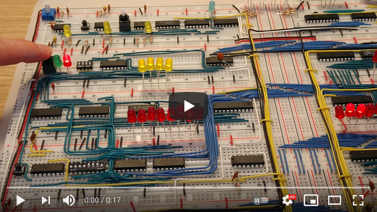
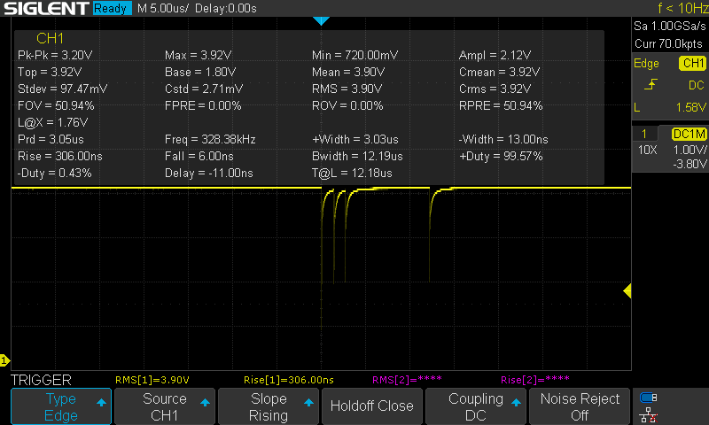
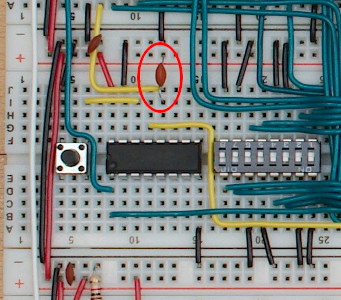
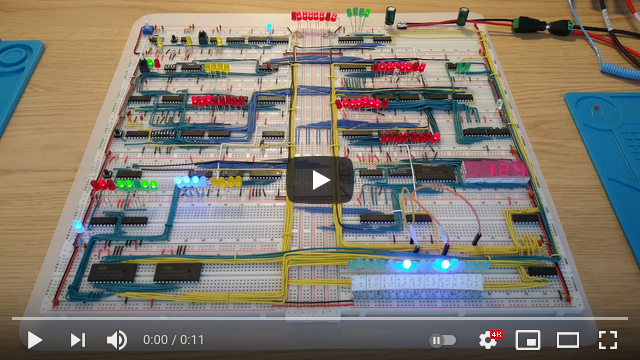
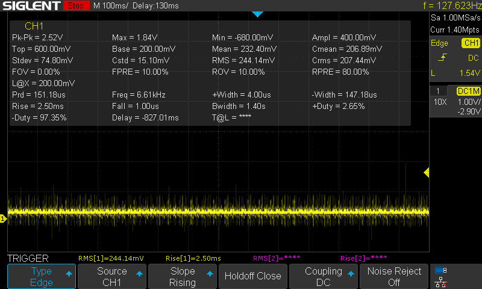
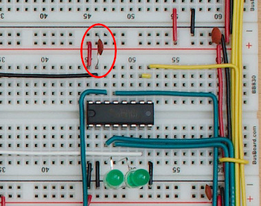
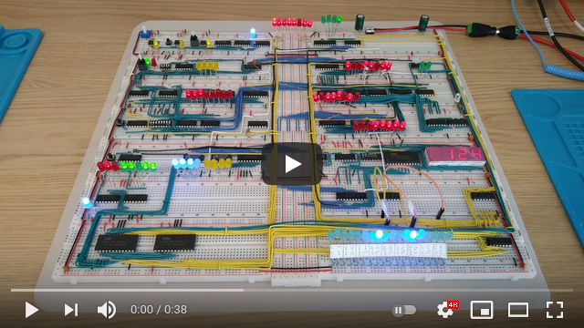
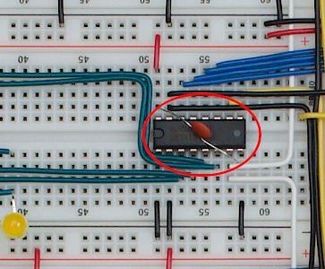

# Issues

I ran into many issues trying to get the 8-bit computer to work. This is my documentation of the issues and the fixes.

## LEDs without resistors

I started by following the videos step by step, and when it came to testing the first register I couldn't get it to work. The red LEDs on the register would be very faint and randomly on/off, and the yellow LEDs on the temporary bus would not light up at all.

The booklet that came with the kit suggested adding resistors to the LEDs, but there wasn't any room on the breadboard for that. I found a good tip in this post on reddit: [What I Have Learned (a master list of what to do and what not to do)](https://www.reddit.com/r/beneater/comments/dskbug/what_i_have_learned_a_master_list_of_what_to_do/)

I soldered resistors to the LEDs as suggested, and the register started working like in the video.

I grew tired of soldering resistors to all the LEDs, so I went for LEDs with resistors built-in instead:

* [Kingbright L-7113ID-5V - 5v Red LED](https://no.rs-online.com/web/p/leds/8609709/)
* [Kingbright L-7113GD-5V - 5v Green LED](https://no.rs-online.com/web/p/leds/8609696/)
* [Kingbright L-7113YD-5V - 5v Yellow LED](https://no.rs-online.com/web/p/leds/8609712/)
* [VCC LTH5MM12VFR4600 - 12v Clear Blue LED](https://www.digikey.no/product-detail/en/visual-communications-company-vcc/LTH5MM12VFR4600/LTH5MM12VFR4600-ND/6691221)

The red, green and yellow LEDs were directly replaceable with the 5v ones from Kingbright, but I could not find any of the blue kind. Most of the blue LEDs are in positions with room for a resistor on the breadboard, so I kept the original ones. I soldered resistors only on the 4 used in the instruction register, seen in the picture above.

The blue were a bit bright with the 220Ω resistors, so I went with 1kΩ resistors on those.

I used the clear blue 12v LEDs for the ALU carry and zero bits (not the flags). They are way too bright on 12v, but fine on 5v.

## Single stepping the clock leads to occasional double step

Video showcasing the glitch:

Notice the very thin dip about 2/3 of the way into the button click. This is enough for it to register as 2 clock ticks:

The problem is in the monostable 555 timer circuit that is supposed to handle debouncing. The size of the capacitor used on pin 6 decides how long the debounce lasts, and the capacitor used by default in the kit is 0.1μF (104). This works fine usually, but not every time. Replacing it with a 0.33μF (334) capacitor makes the debounce much more reliable:

## Long single steps leads to spurious clock ticks

Video showcasing the glitch:

Notice the amount of high frequency noise in the signal as the single step button is pressed:

This is related to the same monostable 555 timer circuit as in the previous issue. But for some reason the signal is clean for a short period when first pressing the button, but pretty soon it gets very noisy. I fixed it by replacing the monostable timer, a Fairchild LM555CN, with a Texas Instruments NE555P. 

The same test looks much better afterwards:

And the clock only ticks once when keeping the button pressed.

## RAM resonance glitch

Video showcasing the glitch:

Everything seemed to work fine when building the RAM module and testing it in isolation. However, when I started connecting the other modules the whole thing started behaving erratic.  

The problem stems from the clock signal that goes into the NAND-gate on the right, through the RC-circuit. The capacitor creates some resonance that travels back through the clock wires and disturbs everything else connected to the same clock, leading to registers latching out of phase with the actual clock.

This shows the original circuit:

And this shows the fixed circuit. The NAND-gate is used to isolate the clock signal by running it through the inverter 2 times before being sent to the RC-circuit.

More about this issue on Reddit: [What I Have Learned](https://www.reddit.com/r/beneater/comments/dskbug/what_i_have_learned_a_master_list_of_what_to_do/).

## RAM mode switch changes memory content

Video showcasing the glitch:

The video shows repeated switching between run mode and programming mode on the RAM module. The address set by the DIP switch is `1111`, and that address in RAM contains the value `0000 1110`. The MAR itself is set to `0001` and that address in RAM contains the value `1100 1111`. The first mode switches works fine, but suddenly the value in RAM at address `0001` changes to `0000 0010`.

The reason can be seen on the oscilloscope:

The oscilloscope probe is connected to pin 12 of the 74LS157 (next to the program button), that goes to pin 3 of the 74189, which is the active-low write-enable pin. The signal should be high when it's not writing to the RAM, but sometimes there is a dip in the signal when pressing the mode switch, making it write whatever it can see on the inputs at the moment. The switch probably has a debounce problem. Putting a 104 capacitor (highlighted) on pin 12 to VCC solves the issue. The signal is not affected anymore when pressing the mode switch after that.

Note that I'm not using the mode switch that came with the kit.

## A register resetting

Video showcasing the glitch:

The video shows the program for counting back and forth between 0 and 255, and when it's supposed to go from 126 to 127 it goes from 126 to 1 instead.

Looking at the reset line connected to the 74LS173 flags register on pin 15 (CLR) we can see quite a bit of noise, including a large spike on the right side at 1.84v. The spike is enough to cause the A register to reset to 0 at the last step of the ADD instruction in the video, when it's about to move 127 from the ALU to the bus. Since the A register turns 0, and the B register is 1, the result of the ADD is 1 which is stored in the A register and displayed shortly after as part of the OUT instruction.

I'm guessing the noise spikes on the reset line are related to power. In this example the ALU has 7 LEDs enabled, the A register has 6. When trying to enable 7 LEDs on the bus it causes a sudden power increase and creates noise that resets the A register.

Putting a 104 capacitor (highlighted) on the reset line to ground on the flags register removes the noise and solves the issue. It's a bit cramped on the A register itself, but the reset line is directly connected between the flags register and the A register, so that's probably why it still has the desired effect.

## Memory address register resetting

Video showcasing the glitch:

The video shows the program for counting back and forth between 0 and 255, but in steps of 31 instead of 1, as can be seen from the binary value of `0001 1111` in the B register. The program seems to get a bit stuck when counting down, taking a long time before continuing. 

The trick to provoking this issue is calculations with larger values. Lower values like the regular counting by 1 works like expected.

The problem starts when it's at the last instruction of the program, and jumps to memory address 4. As soon as the memory address changes to `0100`, which is the subtract instruction, the memory address resets to 0, and the output instruction at address 0 is loaded into the instruction register instead of the subtract instruction. This effectively makes that round in the loop a no-op. This happens a few times before it eventually manages to load the subtract instruction and gets one step further in the countdown. In the video we see the struggle from 124 > 93 > 62, and it's slightly easier to get to 31, and very easy to get to 0, as well as counting up.

There is noise on the reset line on the memory address register as well, but putting a capacitor on pin 15 doesn't completely fix the issue, even though it helps a bit. What fixes it is adding a 104 decoupling capacitor across VCC (pin 16) and ground (pin 8) on the 74LS173, like shown below. The position is very awkward, so be sure not to short any of the pins.

