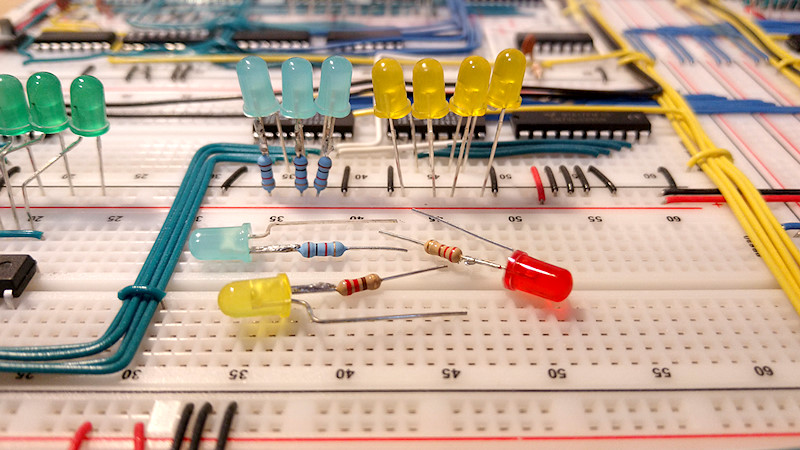
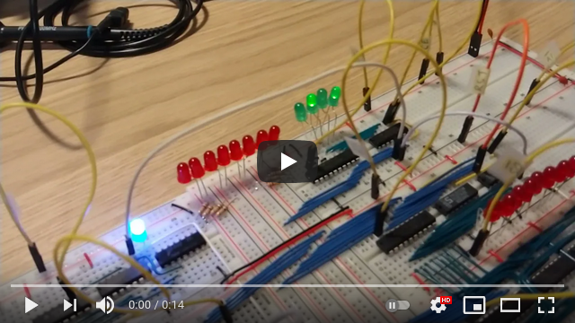
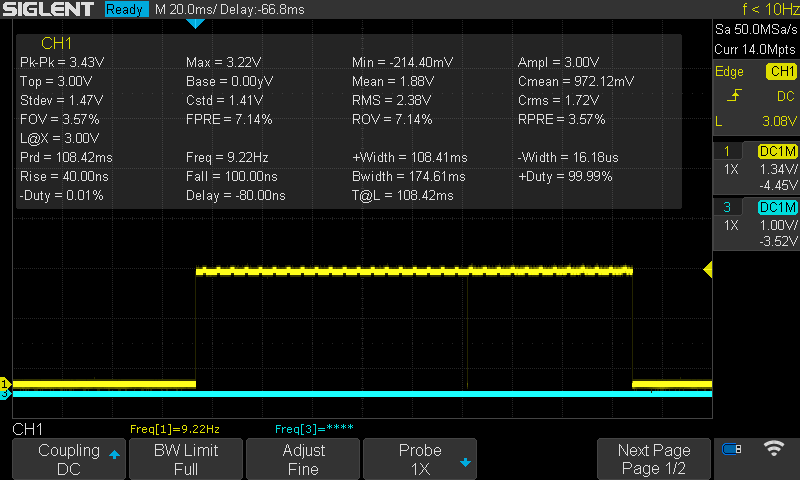
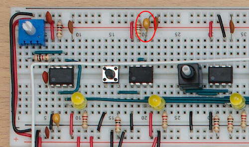
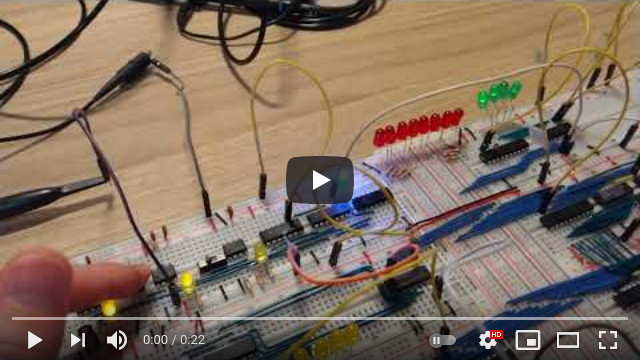
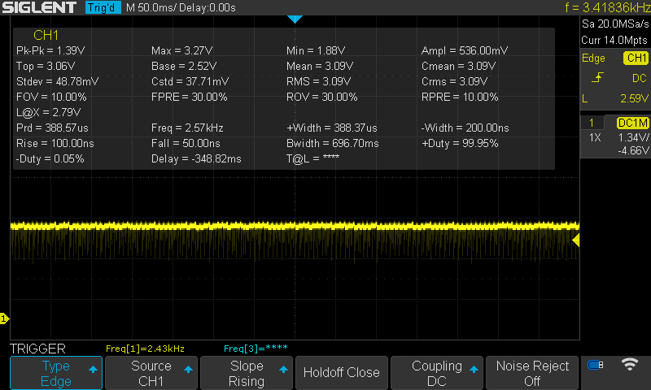
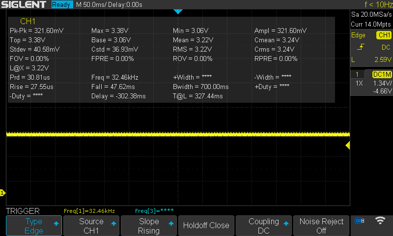
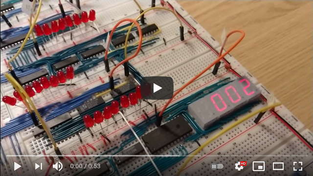
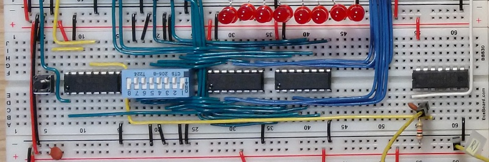
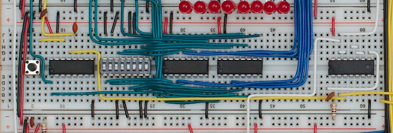

# Issues

I ran into many issues trying to get the 8-bit computer to work. This is my documentation of the issues and the fixes.

## LEDs without resistors

I started by following the videos step by step, and when it came to testing the first register I couldn't get it to work. The red LEDs on the register would be very faint and randomly on/off, and the yellow LEDs on the temporary bus would not light up at all.

The booklet that came with the kit suggested adding resistors to the LEDs, but there wasn't any room on the breadboard for that. I found a good tip in this post on reddit: [What I Have Learned (a master list of what to do and what not to do)](https://www.reddit.com/r/beneater/comments/dskbug/what_i_have_learned_a_master_list_of_what_to_do/)

I soldered resistors to the LEDs as suggested, and the register started working like in the video.

I grew tired of soldering resistors to all the LEDs, so I went for LEDs with resistors built-in instead:

* [Kingbright L-7113ID-5V - 5v Red LED](https://no.rs-online.com/web/p/leds/8609709/)
* [Kingbright L-7113GD-5V - 5v Green LED](https://no.rs-online.com/web/p/leds/8609696/)
* [Kingbright L-7113YD-5V - 5v Yellow LED](https://no.rs-online.com/web/p/leds/8609712/)
* [VCC LTH5MM12VFR4600 - 12v Clear Blue LED](https://www.digikey.no/product-detail/en/visual-communications-company-vcc/LTH5MM12VFR4600/LTH5MM12VFR4600-ND/6691221)

The red, green and yellow LEDs were directly replaceable with the 5v ones from Kingbright, but I could not find any of the blue kind. Most of the blue LEDs are in positions with room for a resistor on the breadboard, so I kept the original ones. I soldered resistors only on the 4 used in the instruction register, seen in the picture above.

The blue were a bit bright with the 220Ω resistors, so I went with 1kΩ resistors on those.

I used the clear blue 12v LEDs for the ALU carry and zero bits (not the flags). They are way too bright on 12v, but fine on 5v.

## Single stepping the clock leads to occasional double step

Video showcasing the glitch:

Notice the very thin dip about 2/3 of the way into the button click. This is enough for it to register as 2 clock ticks:

The problem is in the monostable 555 timer circuit that is supposed to handle debouncing. The size of the capacitor used on pin 6 decides how long the debounce lasts, and the capacitor used by default in the kit is 0.1μF (104). This works fine usually, but not every time. Replacing it with a 0.33μF (334) capacitor makes the debounce much more reliable:

## Long single steps leads to spurious clock ticks

Video showcasing the glitch:

Notice the amount of high frequency noise in the signal as the single step button is pressed:

This is related to the same monostable 555 timer circuit as in the previous issue. But for some reason the signal is clean for a short period when first pressing the button, but pretty soon it gets very noisy. I fixed it by replacing the monostable timer, a Fairchild LM555CN, with a Texas Instruments NE555P. 

The same test looks much better afterwards:

And the clock only ticks once when keeping the button pressed.

## RAM resonance glitch

Video showcasing the glitch:

Everything seemed to work fine when building the RAM module and testing it in isolation. However, when I started connecting the other modules the whole thing started behaving erratic.  

The problem stems from the clock signal that goes into the NAND-gate on the right, through the RC-circuit. The capacitor creates some resonance that travels back through the clock wires and disturbs everything else connected to the same clock, leading to registers latching out of phase with the actual clock.

This shows the original circuit:

And this shows the fixed circuit. The NAND-gate is used to isolate the clock signal by running it through the inverter 2 times before being sent to the RC-circuit.

More about this issue on Reddit: [What I Have Learned](https://www.reddit.com/r/beneater/comments/dskbug/what_i_have_learned_a_master_list_of_what_to_do/).
