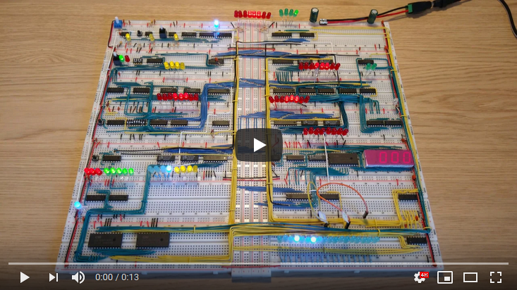

# Program: Add two numbers

Example program that calculates 28+14 and displays the result on the display.

|Instruction|Address|Memory|Comment|
|------|----|---------|------------|
|LDA 14|0000|0001 1110|Put content of memory address 14 into A register|
|ADD 15|0001|0010 1111|Put content of memory address 15 into B register,  and add the sum of A+B into A register|
|OUT   |0010|1110 0000|Output the value of the A register|
|HLT   |0011|1111 0000|Halt the computer|
|      |    |         ||
|      |1110|0001 1100|The value 28|
|      |1111|0000 1110|The value 14|

