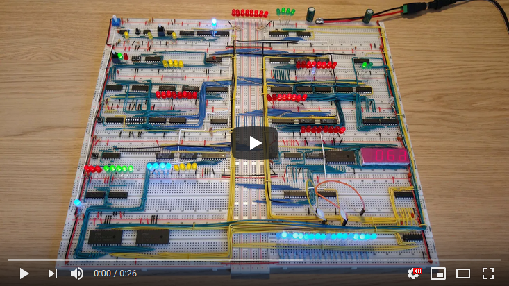

# Program: Counting between 0 and 255

Example program that counts up and down between 0 and 255 in an infinite loop.

|#|Instruction|Address|Memory|Comment|
|---|---------|-------|------|-------|
| 0|OUT   |0000|1110 0000|Output the value of the A-register|
| 1|ADD 15|0001|0010 1111|Put the value of the X variable in the B-register and store A+B in the A-register|
| 2|JC   4|0010|0111 0100|Jump to instruction 4 if the A-register is past 255|
| 3|JMP  0|0011|0110 0000|Jump to instruction 0|
| 4|SUB 15|0100|0011 1111|Put the value of the X variable in the B-register and store A-B in the A-register|
| 5|OUT   |0101|1110 0000|Output the value of the A-register|
| 6|JZ   0|0110|1000 0000|Jump to instruction 0 if the A-register is 0|
| 7|JMP  4|0111|0110 0100|Jump to instruction 4|
|  |      |    |         |                     |
|15|      |1111|0000 0001|The X variable predefined with the value 1|

This table displays the values of registers, variables and output after the first 5 iterations of the program, and at the 2 points where it switches between increasing and decreasing.

|   | 0 | 1 | 2 | 3 | 4 |...|253|254|  255  |256|257|...|508|509| 510 |511|512|
|---|---|---|---|---|---|---|---|---|-------|---|---|---|---|---|-----|---|---|
| A | 1 | 2 | 3 | 4 | 5 |   |254|255|0+C,255|254|253|   | 2 | 1 |0+Z,1| 2 | 3 |
| B | 1 | 1 | 1 | 1 | 1 |   | 1 | 1 | 1     | 1 | 1 |   | 1 | 1 | 1   | 1 | 1 |
| X | 1 | 1 | 1 | 1 | 1 |   | 1 | 1 | 1     | 1 | 1 |   | 1 | 1 | 1   | 1 | 1 |
|OUT| 0 | 1 | 2 | 3 | 4 |   |253|254|255,255|254|253|   | 2 | 1 | 0,0 | 1 | 2 |

* Iteration 255 does both an ADD and a SUB due to the carry bit being set during ADD.
* Iteration 510 does both an SUB and a ADD due to the zero bit being set during SUB.
* Both results in the same value being output twice.

This program is from [Conditional jump instructions](https://www.youtube.com/watch?v=Zg1NdPKoosU).
