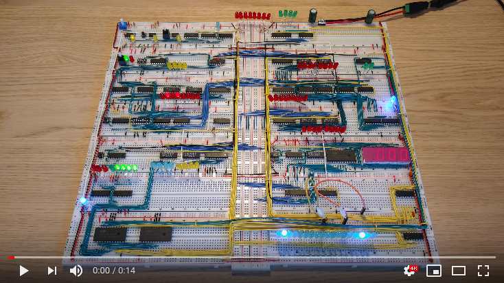

# Program: Fibonacci

Example program that computes the Fibonacci sequence from 0 to 233 in an infinite loop.

In a Fibonacci sequence each number is the sum of the two preceding ones, starting from 0 and 1.

|#|Instruction|Address|Memory|Comment|
|---|---------|-------|------|-------|
| 0|LDI  0|0000|0101 0000|Put the value 0 into the A-register|
| 1|STA 13|0001|0100 1101|Store 0 from the A-register into the X variable|
| 2|OUT   |0010|1110 0000|Output the value of the A-register|
| 3|LDI  1|0011|0101 0001|Put the value 1 into the A-register|
| 4|STA 14|0100|0100 1110|Store the value from the A-register into the Y variable|
| 5|OUT   |0101|1110 0000|Output the value of the A-register|
| 6|ADD 13|0110|0010 1101|Put the value of X variable in the B-register and store A+B in the A-register|
| 7|JC   0|0111|0111 0000|Jump to instruction 0 if A-register is > 255|
| 8|STA 15|1000|0100 1111|Store the value from the A-register into the Z variable|
| 9|LDA 14|1001|0001 1110|Put the value of variable Y into A-register|
|10|STA 13|1010|0100 1101|Store the value from the A-register into the X variable|
|11|LDA 15|1011|0001 1111|Put the value of variable Z into A-register|
|12|JMP  4|1100|0110 0100|Jump to instruction 4|
|13|     X|1101|         |The X variable|
|14|     Y|1110|         |The Y variable|
|15|     Z|1111|         |The Z variable|

The output should be: `0, 1, 1, 2, 3, 5, 8, 13, 21, 34, 55, 89, 144, 233`. This table displays the values of registers, variables and output after the first 5 iterations of the program.

|   | 0 | 1 | 2 | 3 | 4 | 5 |
|---|---|---|---|---|---|---|
| A | 1 | 2 | 3 | 5 | 8 |13 |
| B | 0 | 1 | 1 | 2 | 3 | 5 |
| X | 1 | 1 | 2 | 3 | 5 | 8 |
| Y | 1 | 1 | 2 | 3 | 5 | 8 |
| Z | 1 | 2 | 3 | 5 | 8 |13 |
|OUT|0,1| 1 | 2 | 3 | 5 | 8 |

This program is based on [Programming Fibonacci on a breadboard computer](https://www.youtube.com/watch?v=a73ZXDJtU48).
Using modified instructions from `csbruce` in the comments due to bug in the video that makes it wrap around at 144.
