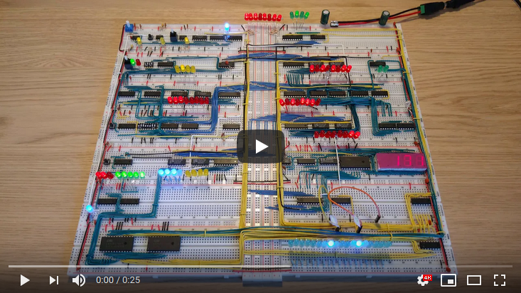

# Program: Increase by 3

Example program that increases by 3 in an infinite loop.

|#|Instruction|Address|Memory|Comment|
|---|------|----|---------|------------|
|0|LDI  3|0000|0101 0011|Put 3 into A register|
|1|STA 15|0001|0100 1111|Store value of A register into memory address 15|
|2|LDI  0|0010|0101 0000|Put 0 into A register|
|3|ADD 15|0011|0010 1111|Put content of memory address 15 into B register,  and add the sum of A+B into A register|
|4|OUT   |0100|1110 0000|Output the value of the A register|
|5|JMP  3|0101|0110 0011|Jump to instruction 3|

This program is from [Adding more machine language instructions to the CPU](https://www.youtube.com/watch?v=FCscQGBIL-Y).
