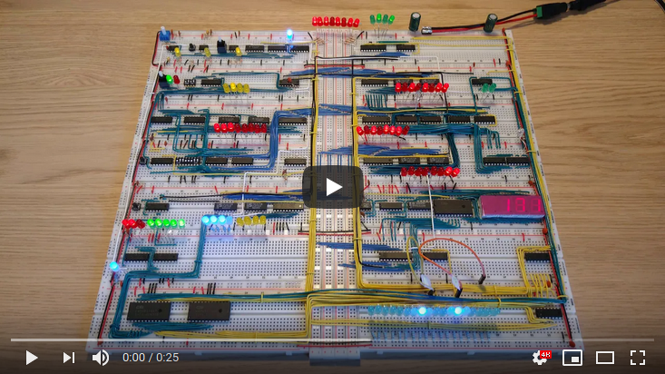

# Program: Increase by 3

Example program that increases by 3 in an infinite loop.

|#|Instruction|Address|Memory|Comment|
|---|---------|-------|------|-------|
| 0|LDI  3|0000|0101 0011|Put the value 3 in the A-register|
| 1|STA 15|0001|0100 1111|Store the value 3 from the A-register in the X variable|
| 2|LDI  0|0010|0101 0000|Put the value 0 in the A-register|
| 3|ADD 15|0011|0010 1111|Put the value of the X variable in the B-register and store A+B in the A-register|
| 4|OUT   |0100|1110 0000|Output the value of the A-register|
| 5|JMP  3|0101|0110 0011|Jump to instruction 3|
|  |      |    |         |              |
|15|     X|1111|         |The X variable|

This table displays the values of registers, variables and output after the first 5 iterations of the program.

|   | 0 | 1 | 2 | 3 | 4 | 5 |
|---|---|---|---|---|---|---|
| A | 3 | 6 | 9 |12 |15 |18 |
| B | 3 | 3 | 3 | 3 | 3 | 3 |
| X | 3 | 3 | 3 | 3 | 3 | 3 |
|OUT| 3 | 6 | 9 |12 |15 |18 |

This program is from [Adding more machine language instructions to the CPU](https://www.youtube.com/watch?v=FCscQGBIL-Y).
