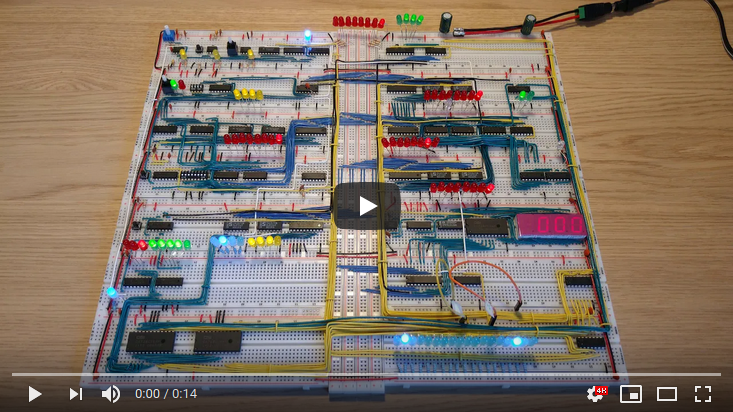

# Program: Multiply two numbers

Example program that calculates 7x8 and displays the result on the display.

|#|Instruction|Address|Memory|Comment|
|---|---------|-------|------|-------|
| 0|LDA 14|0000|0001 1110|Put the value of the X variable in the A-register|
| 1|SUB 12|0001|0011 1100|Put the value of the C constant in the B-register<br>and store A-B in the A-register|
| 2|JC   6|0010|0111 0110|Jump to instruction 6 if the A-register is past 255|
| 3|LDA 13|0011|0001 1101|Put the value of the P variable in the A-register|
| 4|OUT   |0100|1110 0000|Output the value of the A-register|
| 5|HLT   |0101|1111 0000|Halt the computer|
| 6|STA 14|0110|0100 1110|Store the value from the A-register in the X variable|
| 7|LDA 13|0111|0001 1101|Put the value of the P variable in the A-register|
| 8|ADD 15|1000|0010 1111|Put the value of the Y variable in the B-register<br>and store A+B in the A-register|
| 9|STA 13|1001|0100 1101|Store the value from the A-register in the P variable|
|10|JMP  0|1010|0110 0000|Jump to instruction 0|
|  |      |    |         |           |
|12|     C|1100|0000 0001|The C constant predefined with the value 1|
|13|     P|1101|0000 0000|The P (product/answer) variable predefined with the value 0|
|14|     X|1110|0000 0111|The X (multiplicand) variable predefined with the value 7|
|15|     Y|1111|0000 1000|The Y (multiplier) variable predefined with the value 8|

The computer does not have a dedicated instruction for multiplication, so the program adds in a loop. The algorithm can be translated to this C code:
 
```c
int c = 1, p = 0, x = 7, y = 8;
while (x > 0) {
    x = x - c;
    p = p + y;
}
printf("%d", p);
```

The assembly doesn't immediately make sense, as it looks like it would skip the jump with carry and output 0 and halt, due to the first subtraction resulting in the value 6 and not something past 255. The trick is the usage of two's complement when subtracting in the ALU. The subtract instruction tells the ALU to treat the value 1 from the B-register as -1 and add the numbers. -1 is 1111 1111 in two's compliment. So the calculation turns into 0000 0111 (7) + 1111 1111 (255) which is 1 0000 0110 (262), or 0000 0110 (6) with carry since we only have 8 bits and a carry. That jump with carry is actually very useful in this case, as it can be used to easily decrement X by 1 until it's 0, in which case 0 + 255 is 255 and no more carry so the loop ends and the result is printed.

The subtractions are calculated as follows:

|     |   |            |   |                     |   |           |   |   |   |   |
|-----|---|------------|---|---------------------|---|-----------|---|---|---|---|
|7 - 1| ->|7 + -1 (255)| = |0000 0111 + 1111 1111| = |1 0000 0110| = |262| = |6+C|
|6 - 1| ->|6 + -1 (255)| = |0000 0110 + 1111 1111| = |1 0000 0101| = |261| = |5+C|
|5 - 1| ->|5 + -1 (255)| = |0000 0101 + 1111 1111| = |1 0000 0100| = |260| = |4+C|
|4 - 1| ->|4 + -1 (255)| = |0000 0100 + 1111 1111| = |1 0000 0011| = |259| = |3+C|
|3 - 1| ->|3 + -1 (255)| = |0000 0011 + 1111 1111| = |1 0000 0010| = |258| = |2+C|
|2 - 1| ->|2 + -1 (255)| = |0000 0010 + 1111 1111| = |1 0000 0001| = |257| = |1+C|
|1 - 1| ->|1 + -1 (255)| = |0000 0001 + 1111 1111| = |1 0000 0000| = |256| = |0+C|
|0 - 1| ->|0 + -1 (255)| = |0000 0000 + 1111 1111| = |  1111 1111| = |255| = |255|

This table displays the values of registers, variables and output during all iterations of the program.

|   | 0 | 1 | 2 | 3 | 4 | 5 | 6 | 7 |
|---|---|---|---|---|---|---|---|---|
| A | 8 | 16| 24| 32| 40| 48| 56| 56|
| B | 8 | 8 | 8 | 8 | 8 | 8 | 8 | 1 |
| C | 1 | 1 | 1 | 1 | 1 | 1 | 1 | 1 |
| P | 8 | 16| 24| 32| 40| 48| 56| 56|
| X | 6 | 5 | 4 | 3 | 2 | 1 | 0 | 0 |
| Y | 8 | 8 | 8 | 8 | 8 | 8 | 8 | 8 |
|OUT| x | x | x | x | x | x | x | 56|


[](https://www.youtube.com/watch?v=xFFEQVPULzI "Click to play")

This program is from [Conditional jump instructions](https://www.youtube.com/watch?v=Zg1NdPKoosU).


